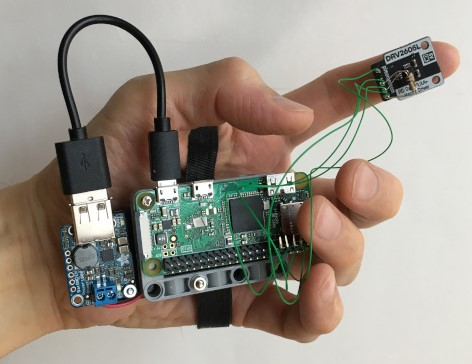

# Threejs-VR-Finger-Haptics
Explore finger haptics with Raspberry Pi, Threejs, and Oculus Quest. 

Unlike other projects (eg. Threejs-VR-Sensors, Threejs-VR-Carbon-Dioxide-Sensor) where sensors send data to a web browser, this one sends data from a web browser to an output haptic device. This repository is for experimenters interested in interfacing I2C devices from Raspberry Pi to wifi devices (eg. Oculus Quest). 

(The green wires are wire wrap wires. Flexible at 30AWG and useful for rapid prototyping.) 

## Hardware

Pi Zero W (model 3B+ works) 

The author uses Pi Zero W because of its small form factor and low power. A small form factor allows it to hide from an Oculus Quest for more reliable hand tracking in WebXR. The deep neural networks in Oculus Quest hand tracking are probably not trained for hands with circuit boards attached. 

A low power Pi Zero W uses ~150mA at 5V that it runs >60min on NiMH AA batteries. 

https://www.raspberrypi.org/documentation/hardware/raspberrypi/power/README.md

The first image shows, left of Pi, an Adafruit PowerBoost 1000 which is a DC-to-DC converter that converts ~2.4V from two NiMH AA batteries to give a stable 5V for Pi Zero W. 

Pimoroni DRV2605L Linear Actuator Haptic Breakout: 

The breakout has both TI DRV2605L haptic driver chip and ELV1411A linear resonant actuator built in. Unlike using ULN2803A and square waves to drive LRA motors (eg. Raspberry-Pi-Time-of-Flight-Haptics), the DRV2605L has circuits to vibrate a LRA motor at its natural frequency and the driving force is an analog sinusoidal wave. LRA is like a tuning fork that vibrate in a narrow range of frequency. It is a mass-on-a-spring (or magnet-on-a-spring) driven by a magnetic coil. 

This experiment uses one finger so one haptic driver with a fixed I2C address 0x5a is fine. 

## Software

Raspberry Pi OS Lite (tested May 7, 2021 release) 

https://www.raspberrypi.org/software/operating-systems/

https://github.com/pimoroni/drv2605-python

sudo pip install drv2605

(if pip or i2c-detect not on Pi OS Lite) 

sudo apt-get update 
sudo apt-get install python-pip 
sudo install i2c-tools 

In a Terminal, "sudo i2cdetect -y 1" displays the hex addresses of I2C devices connected to the Pi. Properly wired, the Pimoroni DRV2605L breakout appears at hex address 0x5a. 

On the side, the author has noticed Melexis MLX90614, in earlier project (https://github.com/Physicslibrary/Threejs-VR-Sensors), has the same address 0x5a. This could be an issue if two devices with the same address are connected to the same bus. The author may investigate what will happen if two 0x5a are connected. However, MLX90614 I2C address can be reconfigured. 

## Programming Pimoroni DRV2605L Linear Actuator Haptic Breakout

Pimoroni's python scripts tap-tap-tap.py and test-waveform.py in https://github.com/pimoroni/drv2605-python/tree/master/examples are excellent examples to start with. The script morse.py is modeled after tap-tap-tap.py. 

## References

Pi Zero W: 

https://www.raspberrypi.org/

https://www.raspberrypi.org/documentation/usage/gpio/

https://github.com/joewalnes/websocketd

Pimoroni DRV2605L Linear Actuator Haptic Breakout: 

https://shop.pimoroni.com/products/drv2605l-linear-actuator-haptic-breakout

https://github.com/pimoroni/drv2605-python

https://ai.facebook.com/blog/hand-tracking-deep-neural-networks/

https://en.wikipedia.org/wiki/Wire_wrap
